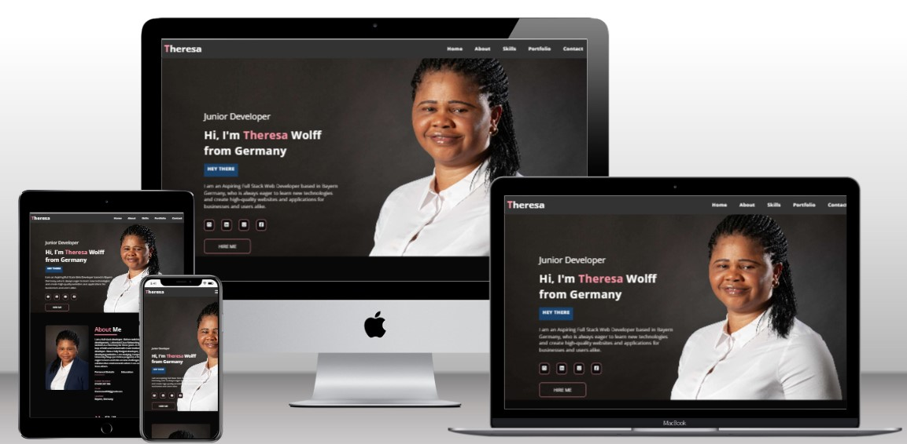
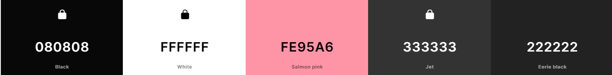

# personal-portfolio-website
Welcome to Theresa's Portfolio! Explore a meticulously curated collection of projects that reflect my expertise, experience, and unwavering passion for full-stack development. Each project embodies my commitment to excellence and innovation in the field, from dynamic web applications to robust software solutions.

# Live Project
The live version can be found [here](https://th-1982.github.io/personal-portfolio-website/)

# Surface
My aim was to create a visually pleasing and stylish design for my portfolio website, so I carefully selected color schemes and fonts that would complement each other. The surface design will enhance the overall look of my website, making it more appealing to visitors.

## Color Scheme
Combining a dark background with a vibrant accent color in the color scheme results in a modern and stylish design for the personal portfolio website. The color scheme of the portfolio website was designed using coolers.co.

## Font
Open Sans is the font used for the personal portfolio website. These fonts were chosen to maintain clarity and legibility in the site.
