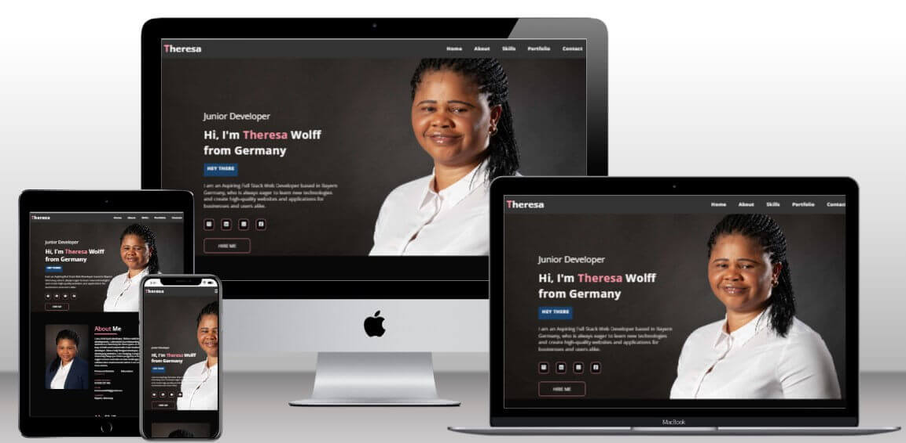
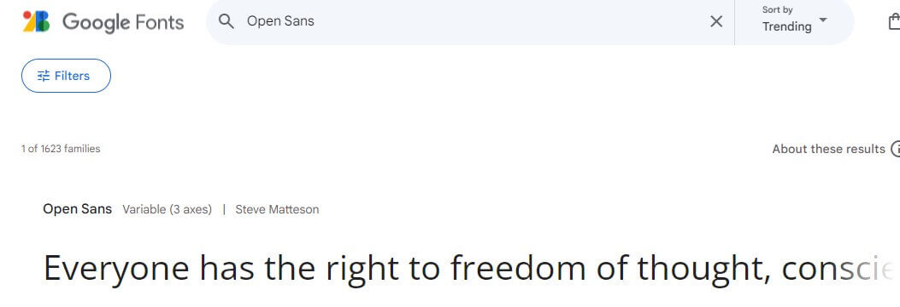

# personal-portfolio-website
Welcome to Theresa's Portfolio! Explore a meticulously curated collection of projects that reflect my expertise, experience, and unwavering passion for full-stack development. Each project embodies my commitment to excellence and innovation in the field, from dynamic web applications to robust software solutions.

# Live Project
The live version can be found [here](https://th-1982.github.io/personal-portfolio-website/)

# Surface
My aim was to create a visually pleasing and stylish design for my portfolio website, so I carefully selected color schemes and fonts that would complement each other. The surface design will enhance the overall look of my website, making it more appealing to visitors.

## Color Scheme
Combining a dark background with a vibrant accent color in the color scheme results in a modern and stylish design for the personal portfolio website. The color scheme of the portfolio website was designed using coolers.co.

## Font
Open Sans is the font used for the personal portfolio website. These fonts were chosen to maintain clarity and legibility in the site.

# Technology Used

## Languages
* HTML
* CSS
* JavaScript

## Frameworks & Tools
* [GitHub](https://github.com/) - Host for the respostory
* [Google Fonts](https://fonts.google.com/) - Source of fonts
* [VS Code](https://code.visualstudio.com/) - Code editor
* [Font Awesome](https://fontawesome.com/) - Source of icons
* [Coolors.co](https://coolors.co/) - Tool used for generating color schemes and palettes
* [TinyPNG](https://tinypng.com/) - Tool used for compressing and optimizing images.
* [w3C](https://validator.w3.org/) - Tool used for code validation.
* [Favicon](https://favicon.io/) - Tool used for website Identification  and visual consistency.
* [Mockup Generator](https://techsini.com/multi-mockup/) - Used to create mockups.
* Chrome DevTools - Testing tool

# Testing 
## Accessibilty & Performance
* The lighthouse feature on Google Devtools was used to assess accessibility and performance. The pages score high on accessibility and performance.  

  
Lighthouse

  
  

## Responsiveness
* The webpage for this website was tested for various devices, making use of both DevTools.
It was adapted for desktops, laptops, and mobile devices under CSS Media queries.

## HTML Validation
* The W3C markup Validation Service was used to validate the HTML of the website. All pages passed with no errors or warnings.

HTML Validation Screenshot

  
  

## CSS Validation
* The W3C Jigsaw CSS Validation Service was used to validation the CSS of the website. The code passed with no errors or warnings.

CSS Validation Screenshot

  
  

## Browser Compatibility

  The website compatabiity was tested on the following browsers:
  * Google Chrome 
  * Firefox
  * Microsoft Edge

# Development Process
## Development & Deployment
The project was developed using GitHub and GitPod platforms.

* Navigate to: "Repositories" and create "New".
* Mark the following fields: ✓ Public ✓ Add a README file.
* Select template: "Code-Institute-Org/gitpod-full-template".
* Add a Repository name: "personal-portfolio-website".
* And create Repository.

This project was developed using VS Code and GitPod suffered various executions using the inbuild Terminal.
* git add . - Command used before commiting.
* git commit -m "written imperative declaration" - Command used to declare changes and updates.
* git push - Command used to push all updates to the GitHub Repository and live version.

The website was deployed via Github
* Under the given Repository, navigate to "Settings".
* Navigate to "Pages" from the left-hand bar.
* From here the "Source" should be set to "Deploy from branch".
* On "Branch" select "main" and save.
* The website was deployed via Github and the live website can be found [here](https://th-1982.github.io/personal-portfolio-website/).

